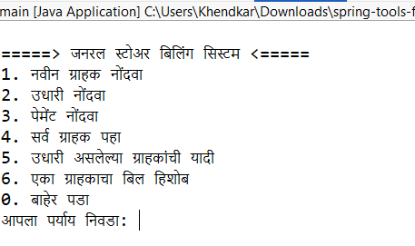

# 🏪 General Store Billing System (Java Console App with Hibernate & PostgreSQL)

This is a **menu-driven Java console application** for managing customers, credit transactions, and payments in a **general store**, developed using:
- Java 17+
- JPA with Hibernate 7.x
- PostgreSQL
- Maven

---

## 📌 Features

- Add new customers
- Record customer credits (उधारी)
- Record payments
- View all customers
- View pending dues report
- View bill summary for a specific customer

---

## 🛠 Technologies Used

| Tech               | Version       |
|--------------------|---------------|
| Java               | 17+           |
| Maven              | Latest        |
| Hibernate ORM      | 7.x           |
| JPA (Jakarta)      | 3.x           |
| PostgreSQL         | 14+           |
| IDE                | Spring Tool Suite / IntelliJ / Eclipse |

---

## 🧱 Project Structure
```
src/
├── main/
│ ├── java/
│ │ └── app/
│ │ ├── entity/ # JPA Entity Classes
│ │ ├── dao/ # DAO Layer (CustomerDAO, CreditDAO, PaymentDAO)
│ │ ├── service/ # ReportService class
│ │ └── Main.java # Console Menu
│ └── resources/
│ └── META-INF/
│ └── persistence.xml # Hibernate Configuration
```

---

## 🧾 Database Setup (PostgreSQL)

1. Open **pgAdmin** or terminal.
2. Create database:

```sql
CREATE DATABASE gs_billing_db;
```

3. Tables will be auto-created by Hibernate on first run

---

## ⚙️ Dependencies Used

The project uses the following key dependencies:

- **Hibernate ORM** (`v6.4.4.Final`) – For advanced object-relational mapping.
- **Jakarta Persistence API** (`v3.1.0`) – Standard JPA annotations & interfaces.
- **PostgreSQL JDBC Driver** (`v42.7.3`) – Database connectivity.
- **Java 17** – Modern Java features enabled via Maven compiler plugin.

---

## ⚙️ Persistence Configuration

- JPA with Hibernate 6.4.4  
- DB: PostgreSQL (`gs_billing_db`)  
- Entities: `Customer`, `Credit`, `Payment`  
- `persistence.xml` location: `src/main/resources/META-INF/`  
- Schema Auto Update: `hibernate.hbm2ddl.auto=update`  
- SQL Logging: Disabled (`show_sql=false`, `format_sql=false`)

---

## ▶️ How to Run

1. Clone or download the project.
2. Open it in Spring Tool Suite, IntelliJ, or Eclipse.
3. Update DB credentials in `persistence.xml`.
4. Build and run:

```bash
mvn clean install
```

5. Run `Main.java` and follow the console menu.

---

## 📂 Sample Output



---

## 🙋‍♀️ Author

> **Name:** Pranita Khendkar  
> **Email:** pranitakhendkar@example.com  
> **GitHub:** [github.com/PranitaK19](https://github.com/PranitaK19)

---

✨ *Thank you for using this billing system!*
